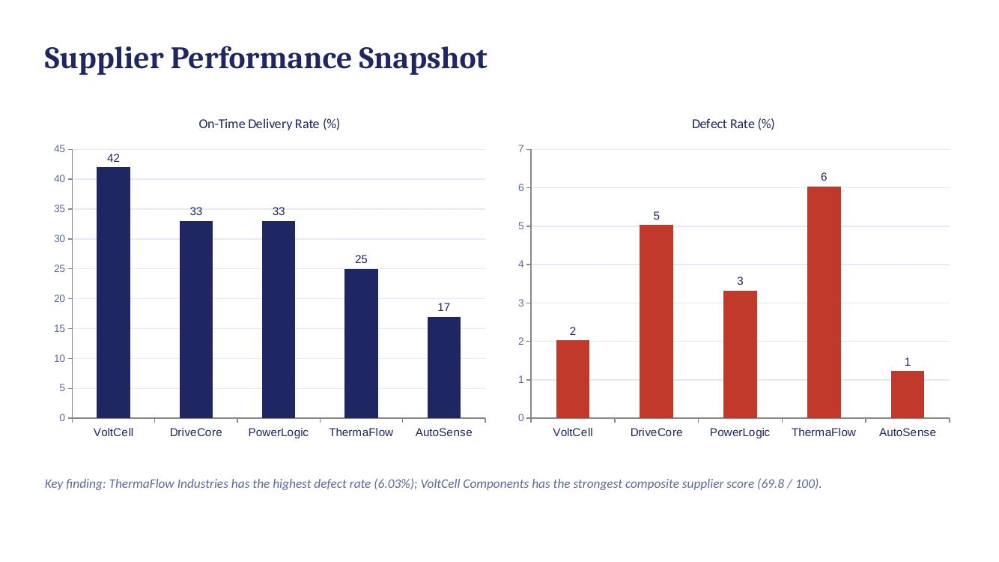
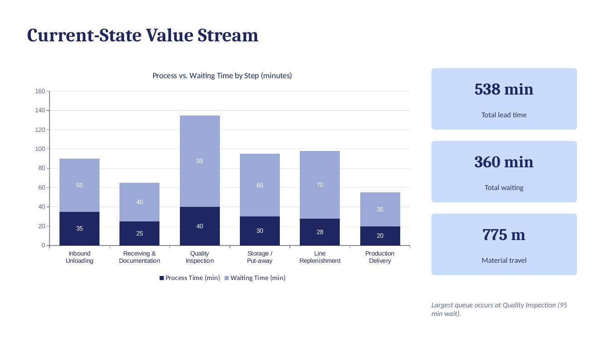
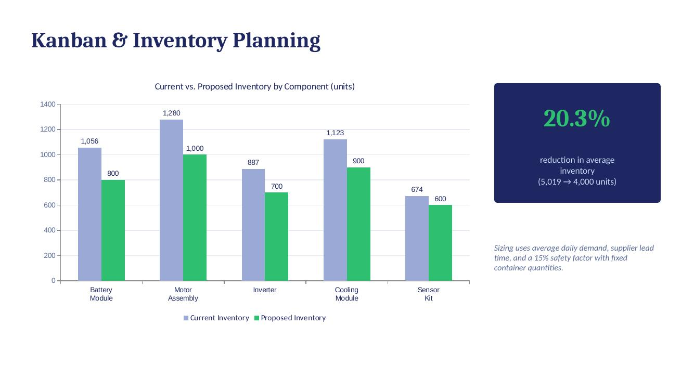
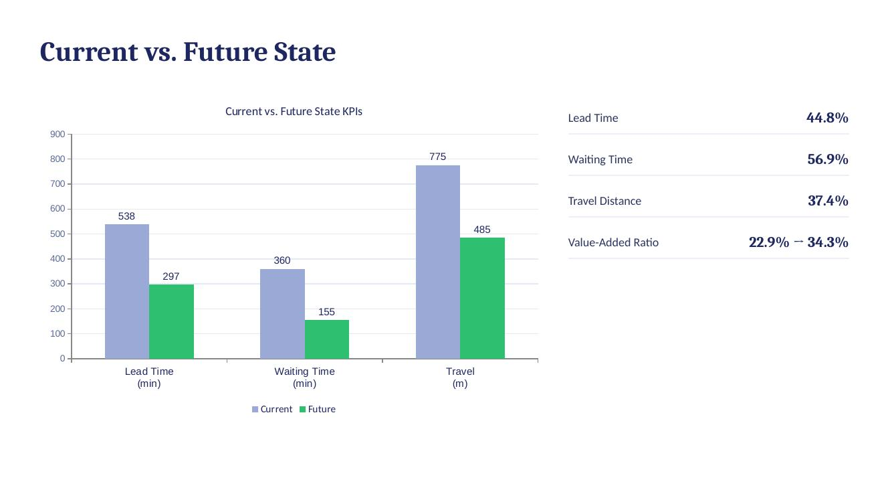

# Lean-Supply-Chain-Material-Flow-Optimization

> Redesigning a supplier-to-production material flow using Lean principles to cut lead time, inventory, and internal travel.

## Overview

This project analyzes the inbound supply chain of an EV component manufacturer sourcing 5 critical components from 5 suppliers. Using Lean principles — value, value stream, flow, pull, perfection - it designs a future-state material flow built on Value Stream Mapping (VSM), Kanban pull replenishment, 6S, and standardized work.

## Why This Matters

Manufacturers relying on multiple suppliers often carry excess buffer inventory and long internal wait times just to protect against delivery variability. That buffers working capital instead of freeing it, and slows a plant's ability to respond to demand changes. A Lean redesign targets the actual sources of delay — not just the symptoms.

## Problem

Inconsistent supplier lead times and variable quality created ripple effects across the plant floor: excess buffer inventory, long internal waiting time, and avoidable material travel between receiving, inspection, storage, and production.

**Key challenges:**
- Supplier lead-time and defect-rate variability across 5 suppliers
- 360 minutes of internal waiting time out of a 538-minute total lead time
- 775 meters of internal material travel per cycle
- No structured pull-replenishment system — inventory managed on buffer stock, not consumption

## Approach

**Measure** - 12 months of operating data across 60 supplier-month observations (demand, lead time, defects, fill rate, cost)

**Diagnose** - Supplier scorecards, lead-time variability, defect-rate analysis, and current-state VSM

**Design** - Kanban pull replenishment sized on daily demand, lead time, and a 15% safety factor; 6S and standardized work for the future state

**Control** — Recurring supplier scorecards, KPI reviews, and continuous-improvement backlog

## Results

| Metric | Current | Future | Improvement |
|---|---|---|---|
| Total lead time | 538 min | 297 min | **44.8%** ↓ |
| Waiting time | 360 min | 155 min | **56.9%** ↓ |
| Material travel | 775 m | 485 m | **37.4%** ↓ |
| Average inventory | 5,019 units | 4,000 units | **20.3%** ↓ |
| Value-added ratio | 22.9% | 34.3% | **+11.5 pts** |

